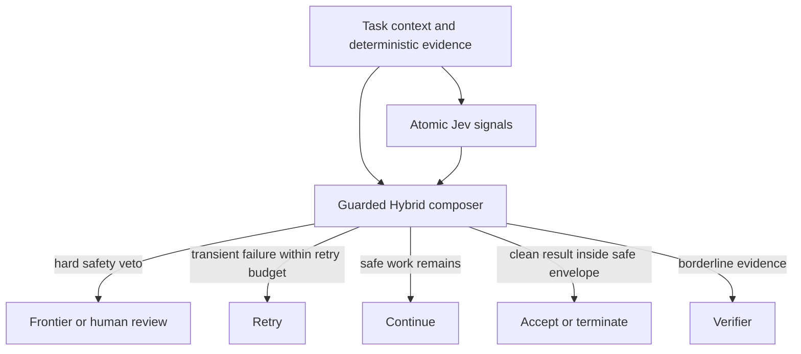

# Reflex Control

[](LICENSE)
[](https://www.rust-lang.org)

Reflex Control is a calibrated System-1 control plane for AI agents. It combines deterministic execution evidence with narrow semantic signals so routine work can proceed cheaply while risky or uncertain work is deferred.

## v0.1 architecture

Candidate E, the **Guarded Hybrid**, is the frozen default architecture for v0.1. It is an experimental release candidate backed by a synthetic evaluation; it is not a production-proven safety system.

TypeSafe Jev is used only as an **atomic semantic evidence provider**. It estimates 11 narrow conditions such as `security_risk`, `failure_is_transient`, `worker_out_of_scope`, `objective_satisfied`, and `independent_verification_needed`. Jev does not orchestrate the agent and cannot override deterministic safety rules.



The three policy layers are:

1. Deterministic and security vetoes. Failed tests, exhausted retries, security hazards, and scope violations cannot be bypassed by a learned score.
2. Safe progression. Incomplete, low-risk work may continue; transient failures may retry within a fixed budget.
3. Calibrated acceptance. Only tasks inside the safe envelope are evaluated with the clean-quality score.

The frozen thresholds are stored in [`fixtures/frozen_hybrid_config.json`](fixtures/frozen_hybrid_config.json):

- maximum composite risk for autonomous acceptance, `tau_accept = 0.28`
- clean-quality threshold, `theta_clean = 0.38`
- small-reasoner ceiling, `0.58`
- mandatory frontier threshold, `0.70`

## Evaluation result and limits

The strongest existing result is a 100-task held-out, curated synthetic evaluation using live TypeSafe Jev inference. Candidate E resolved 69 tasks autonomously and made no observed frontier-defect leakage errors.

| Measure | Candidate E result | Definition |
| :--- | :---: | :--- |
| Autonomous coverage | 69/100 (69%) | `accept`, `terminate`, `retry`, or `continue` without a verifier/frontier call |
| Frontier calls avoided | 69/100 (69%) | tasks that did not call the frontier tier |
| Defect leakage / FNR | 0/31 (0%) | frontier-required tasks that did not reach the frontier tier |
| False alarms / FPR | 0/69 (0%) | non-frontier tasks unnecessarily sent to the frontier tier |
| Unsafe-to-accept tasks | 43/100 | 31 frontier-required tasks plus 12 transient tasks that required `retry` |

The 95% Wilson interval for 69/100 coverage is approximately 59.4%–77.2%. With 0 observed leakage events among 31 frontier-required tasks, the 95% Wilson upper bound is approximately 11.0% and the one-sided 95% Clopper-Pearson upper bound is approximately 9.2%. Zero observed errors therefore does not establish a true 0% risk rate.

The fixtures are synthetic and curated, with explicit ground truth and a controlled class distribution. Their timestamps are synthetic scenario data, not collection dates. Live Jev inference was used for the reported blind run, but the tasks are not production traffic. Historical experiments and raw outputs are preserved under [`docs/experiments/`](docs/experiments/).

Metric terms are used consistently throughout the current evaluator:

- **False accept rate (FAR):** defective autonomous accepts divided by all autonomous accepts/terminations.
- **False negative rate (FNR) / defect leakage:** frontier-required tasks that missed frontier review divided by all frontier-required tasks.
- **False positive rate (FPR) / false alarm rate:** non-frontier tasks sent to frontier review divided by all non-frontier tasks.

## Workspace

```text
crates/reflex-core          Domain types and evidence model
crates/reflex-provider      Provider abstractions and mock provider
crates/reflex-jev           TypeSafe Jev client and atomic evidence provider
crates/reflex-policy        Guarded Hybrid and supporting policies
crates/reflex-telemetry     SQLite telemetry and outcome linkage
crates/reflex-calibration   Metrics, confidence intervals, and calibration
crates/reflex-cli           reflex command-line interface
examples/                   Runnable verifier-gate and shadow-mode examples
fixtures/                   Synthetic evaluation fixtures and frozen config
docs/experiments/           Archived research history and raw reports
```

## Install and run

Rust 1.88 or newer is required.

```bash
cargo install --path crates/reflex-cli
reflex init
```

Mock mode does not require credentials:

```bash
reflex run --provider mock --context "Check whether the worker patch is safe" --risk low
```

For live TypeSafe Jev inference, copy [`.env.example`](.env.example) or export the key without committing it:

```bash
export JEV_API_KEY="your_typesafe_jev_api_key"
reflex run --provider jev --context "Add docstrings and verify the test suite" --risk low
```

Live evaluation commands call the TypeSafe API and may incur cost. The release evaluation can be reproduced with the frozen configuration, but normal development and CI use local fixtures and mock providers:

```bash
reflex experiment --version v2 --phase blind --provider jev
```

## Examples

```bash
cargo run -p example-verifier-gate
cargo run -p example-shadow-mode
```

The verifier-gate example demonstrates a clean autonomous pass and a hard security veto. The shadow-mode example records a prediction without changing the host orchestrator's decision. See [`examples/README.md`](examples/README.md).

## Quality gates

```bash
cargo fmt --all -- --check
cargo clippy --workspace --all-targets -- -D warnings
cargo test --workspace
cargo test --release --workspace
cargo build --release --workspace
```

## Known limitations and v0.2 direction

- The v0.1 evidence comes from a small synthetic benchmark and does not measure production reliability or domain shift.
- Live provider latency, availability, and output can vary between runs.
- Thresholds must be validated on local shadow-mode telemetry before production use.
- v0.2 is expected to add alternative evidence providers, OpenTelemetry export, and broader evaluation on real workloads.

## License

Licensed under either the Apache License, Version 2.0, or the MIT license, at your option. See [`LICENSE`](LICENSE), [`LICENSE-APACHE`](LICENSE-APACHE), and [`LICENSE-MIT`](LICENSE-MIT).
